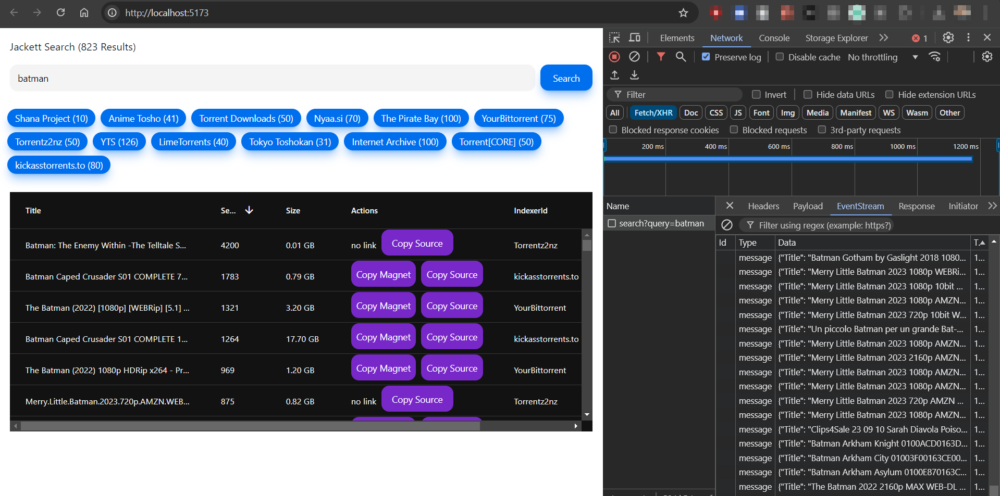

````markdown
# Jackett Search UI

This is a simple React UI for searching torrents using Jackett.

## Features

- Search for torrents using a [Jackett API endpoint](https://github.com/bharathganji/jackett-python).
- Display search results in a table with information like title, seeders, leechers, size, and indexer.
- Copy magnet links and source links to clipboard.
````


## Getting Started

1. **Clone the repository:**

   ```bash
   git clone https://github.com/your-username/jackett-search-ui.git
   ```

2. **Install dependencies:**

   ```bash
   cd jackett-search-ui
   npm install
   ```

3. **Set up environment variables:**

   Create a `.env` file in the root of the project and add the following line:

   ```
   VITE_JACKETT_API_URL=http://your-jackett-server:port
   ```

   Replace `http://your-jackett-server:port` with your actual Jackett API URL.

4. **Start the development server:**

   ```bash
   npm run dev
   ```

   The app will be available at `http://localhost:5173`.

## Usage

1. Enter a search query in the input field.
2. Click the "Search" button.
3. Results will be displayed in the table.
4. Click the "Copy Magnet" or "Copy Source" buttons to copy the corresponding links to your clipboard.

## Technologies

- React
- TypeScript
- Ag-Grid
- Vite



## Contributing

Contributions are welcome! Please open an issue or submit a pull request.

### License

This project is licensed under the [MIT License](LICENSE).

### Disclaimer

This project is for educational purposes and is not intended for illegal activities. Please respect the copyright and intellectual property rights of others. 

