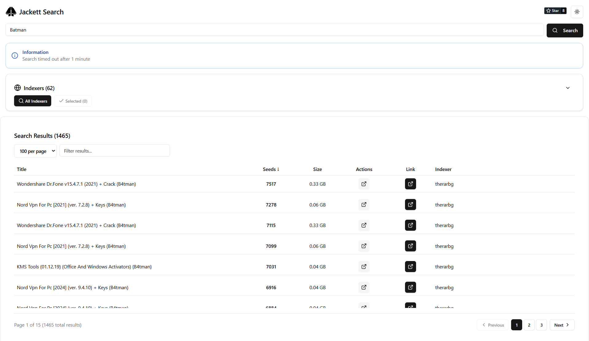

```markdown
# Jackett Search UI

A modern, responsive React-based UI for searching torrents using Jackett with real-time streaming results, advanced filtering, and efficient caching.

## ✨ Features

- **Real-time Search**: Stream search results as they come in from multiple indexers
- **Modern UI**: Built with React 19, TypeScript, and Tailwind CSS
- **Responsive Design**: Mobile-first design that works on all devices
- **Advanced Filtering**: Filter results by size, seeders, and indexer
- **Virtualized Results**: Efficient rendering of large result sets using TanStack Virtual
- **Dark/Light Theme**: Toggle between themes with next-themes
- **Copy to Clipboard**: Easy copying of magnet links and source URLs
- **Modern Components**: Built with shadcn/ui components
```

## 🚀 Getting Started

### Prerequisites

- Node.js >= 18
- npm >= 9

### Installation

1. **Clone the repository:**

   ```bash
   git clone https://github.com/bharathganji/jackett-search-ui.git
   cd jackett-search-ui
   ```

2. **Install dependencies:**

   ```bash
   npm install
   ```

3. **Set up environment variables:**

   Copy the example environment file and configure it:

   ```bash
   cp .env.example .env
   ```

   Edit `.env` and add your Jackett API URL:

   ```env
   VITE_JACKETT_API_URL=http://your-jackett-server:port
   ```

   Replace `http://your-jackett-server:port` with your actual Jackett API URL.

4. **Start the development server:**

   ```bash
   npm run dev
   ```

   The app will be available at `http://localhost:5173`.

## 📖 Usage

1. **Search**: Enter your search query in the input field
2. **Real-time Results**: Watch as results stream in from multiple indexers
3. **Filter**: Use the filter options to narrow down results by:
   - File size (min/max)
   - Seeders count
   - Specific indexers
4. **Copy Links**: Click the copy buttons to get magnet links or source URLs
5. **Theme Toggle**: Switch between light and dark themes using the theme toggle

## 🛠️ Available Scripts

- `npm run dev` - Start development server
- `npm run build` - Build for production
- `npm run preview` - Preview production build
- `npm run lint` - Run ESLint
- `npm run lint:fix` - Fix ESLint issues
- `npm run format` - Format code with Prettier
- `npm run format:check` - Check code formatting
- `npm run release` - Create a new release

## 🛠️ Tech Stack

### Core

- **React 19** - Latest React with concurrent features
- **TypeScript** - Type-safe development
- **Vite** - Fast build tool and dev server

### UI & Styling

- **Tailwind CSS** - Utility-first CSS framework
- **shadcn/ui** - Modern component library
- **Radix UI** - Accessible component primitives
- **Lucide React** - Beautiful icons
- **next-themes** - Theme management

### Performance & UX

- **TanStack Virtual** - Virtualized scrolling for large lists
- **Sonner** - Toast notifications
- **Class Variance Authority** - Component variants

### Development Tools

- **ESLint** - Code linting
- **Prettier** - Code formatting
- **Husky** - Git hooks
- **Commitlint** - Conventional commits
- **Standard Version** - Automated versioning



## 🤝 Contributing

Contributions are welcome! Please follow these steps:

1. Fork the repository
2. Create a feature branch (`git checkout -b feature/amazing-feature`)
3. Make your changes
4. Run the linter and formatter (`npm run lint:fix && npm run format`)
5. Commit your changes using conventional commits
6. Push to the branch (`git push origin feature/amazing-feature`)
7. Open a Pull Request

### Development Guidelines

- Follow the existing code style
- Write meaningful commit messages using [Conventional Comm
  ps://conventionalcommits.org/)
- Add tests for new features
- Update documentation as needed

## 📄 License

This project is licensed under the [MIT License](LICENSE).

## ⚠️ Disclaimer

This project is for educational purposes and is not intended for illegal activities. Please respect the copyright and intellectual property rights of others.

## 🙏 Acknowledgments

- [Jackett](https://github.com/Jackett/Jackett) - The awesome torrent indexer aggregator
- [shadcn/ui](https://ui.shadcn.com/) - For the beautiful component library
- [Lucide](https://lucide.dev/) - For the clean icons

## 📞 Support

If you encounter any issues or have questions:

1. Check the [Issues](https://github.com/bharathganji/jackett-search-ui/issues) page
2. Create a new issue if your problem isn't already reported
3. Provide as much detail as possible including:
   - Your environment (OS, Node.js version, browser)
   - Steps to reproduce the issue
   - Expected vs actual behavior

---

Made with ❤️ by [Bharath Ganji](https://github.com/bharathganji)
